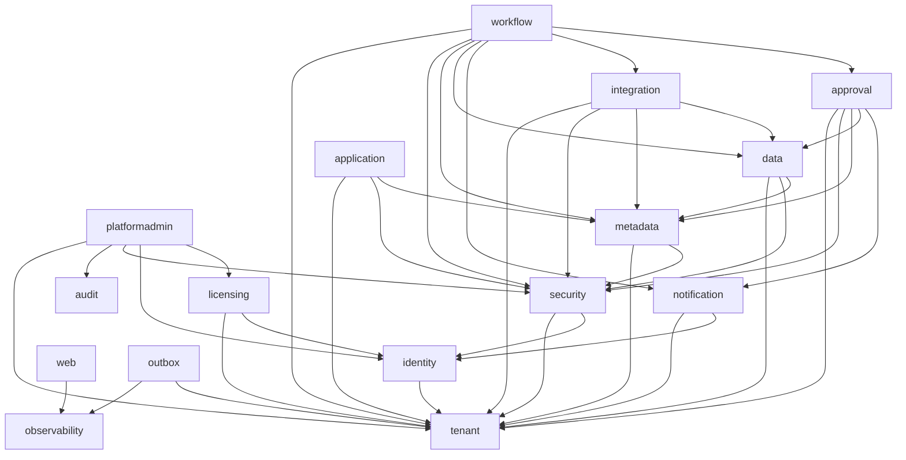

# Logical modules and allowed dependencies

The authoritative declaration is each module's `package-info.java`
(`platform-app/src/main/java/app/platform/<module>/package-info.java`); the architecture tests fail the build if
code disagrees with it. This table must be updated in the same pull request as any change to those files
(and the change recorded in [ADR-0001](adr/0001-modular-monolith.md)).

Module identifiers are package names, so the platform-admin module is `platformadmin`.

| Module | Responsibility | First built | May depend on (besides `sharedkernel`) |
|--------|----------------|-------------|----------------------------------------|
| `sharedkernel` | Identifiers and cross-cutting interfaces (secrets store, event publisher and handler contracts). Open to all. Separate Maven module. | S0 | nothing |
| `tenant` | Organizations, tenant lifecycle, tenant context, hostname resolution (ADR-0014, ADR-0017) | S2 | nothing |
| `identity` | Users, credentials, sign-in, sessions and tokens, the provider abstraction (S3: [ADR-0019](adr/0019-authentication-implementation.md) to [ADR-0021](adr/0021-brute-force-protection-and-rate-limits.md)); memberships and invitations follow in S5 | S3 | tenant |
| `licensing` | Plans, licence pools, feature entitlements | S6 | tenant, identity |
| `security` | Profiles, roles, permission sets, groups, authorization decision engine | S7 | tenant, identity |
| `metadata` | Object, field, layout, application definitions; versioning | S10 | tenant, security |
| `data` | Tenant business records, queries, record-level security | S14 | tenant, metadata, security |
| `application` | Tenant-created applications and navigation | S12 | tenant, metadata, security |
| `notification` | Email and in-app notifications | S4 | tenant, identity |
| `approval` | Approval definitions, instances, history | S24 | tenant, metadata, security, data, notification |
| `integration` | Connector framework and adapters; the only module that knows external systems | S26 | tenant, metadata, security, data |
| `workflow` | Workflow definitions, triggers, actions, execution | S22 | tenant, metadata, security, data, approval, notification, integration |
| `audit` | Append-only audit records. Version 0 arrived in S3 (the `AuditRecorder` contract is in `sharedkernel`; the module writes the platform-level table `audit_record`, [ADR-0022](adr/0022-platform-level-identity-tables-and-audit-v0.md)); the full module is S9 | S9 (v0 in S3) | nothing |
| `observability` | Request correlation, error tracking hook, database correlation stamp (infrastructure) | S1 | nothing |
| `outbox` | Transactional outbox, polling relay, idempotent consumer base (infrastructure, ADR-0016). Other modules use the event contracts of `sharedkernel`, never this module | S2 | tenant, observability |
| `web` | HTTP conventions: error model handling, paging binding, OpenAPI, platform status endpoint (infrastructure) | S1 | observability |
| `platformadmin` | Platform-level administration, separate from tenant administration | S6 | tenant, identity, licensing, security, audit |

## Rules

1. Another module may use only the types in a module's root package. Sub-packages are internal.
2. No module reads or writes another module's tables.
3. Cross-module reactions use events (the outbox of Sprint 2), not direct calls "backwards" up the graph.
   Example: `audit` depends on nothing; modules publish events through `EventPublisher` and `audit` consumes them
   with an `EventHandler` bean; both interfaces are in `sharedkernel`, so neither side depends on `outbox`.
4. Only `integration` may reference `app.platform.integration.adapter..`.
5. The graph must stay acyclic. A needed edge that would create a cycle means a missing event or a missing
   module, not a cycle.
6. Adding an edge: edit the module's `package-info.java`, edit this file, note it in the pull request.
7. `web`, `observability` and `outbox` are infrastructure modules ([ADR-0011](adr/0011-api-conventions.md),
   [ADR-0012](adr/0012-observability.md)). Business modules never depend on `web` (an architecture test enforces it):
   their controllers use the types of the API contract and throw `ApiException`. A business module that needs to
   report an unexpected error may depend on `observability` through the process in rule 6.
8. Passwords, tokens and the authorization server stay inside `identity`: no other module may use the cryptography and
   authorization-server libraries (an architecture test enforces it), and no business module reads the caller from the security
   framework's static holder; it reads `TenantContexts` (the user is filled in from Sprint 3) or asks the identity module's public API.
