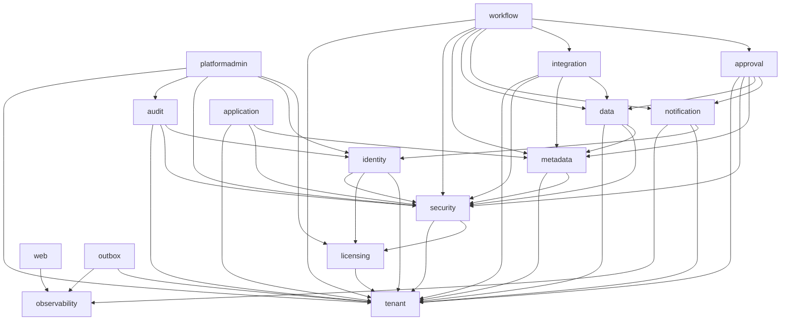

# Logical modules and allowed dependencies

The authoritative declaration is each module's `package-info.java`
(`platform-app/src/main/java/app/platform/<module>/package-info.java`); the architecture tests fail the build if
code disagrees with it. This table must be updated in the same pull request as any change to those files
(and the change recorded in [ADR-0001](adr/0001-modular-monolith.md)).

Module identifiers are package names, so the platform-admin module is `platformadmin`.

| Module | Responsibility | First built | May depend on (besides `sharedkernel`) |
|--------|----------------|-------------|----------------------------------------|
| `sharedkernel` | Identifiers and cross-cutting interfaces (secrets store, event publisher and handler contracts). Open to all. Separate Maven module. | S0 | nothing |
| `tenant` | Organizations, tenant lifecycle, tenant context, hostname resolution (ADR-0014, ADR-0017) | S2 | nothing |
| `identity` | Users, credentials, sign-in, sessions and tokens, the provider abstraction (S3: [ADR-0019](adr/0019-authentication-implementation.md) to [ADR-0021](adr/0021-brute-force-protection-and-rate-limits.md)); memberships, invitations and organization switching (S5: [ADR-0026](adr/0026-membership-lifecycle-and-the-administrator-marker.md) to [ADR-0029](adr/0029-switching-organizations.md)); platform roles, administrative sessions and the first-administrator invitation (S6: [ADR-0030](adr/0030-platform-roles-and-the-first-platform-administrator.md), [ADR-0036](adr/0036-administrative-sessions.md), [ADR-0037](adr/0037-provisioning-an-organization-for-a-client.md)); the abilities a member holds decide every administrative action, and invitations create members with a profile and role (S7: [ADR-0043](adr/0043-replacing-the-administrator-marker.md)) | S3 | tenant, licensing, security |
| `licensing` | Plans, licence types, pools and assignments, subscriptions and trials, feature entitlements (S6: [ADR-0031](adr/0031-where-the-platform-tables-live-and-how-an-organization-is-reached.md) to [ADR-0034](adr/0034-feature-entitlements.md)). **Depends on `tenant` only**: the identity module calls it, so a licence goes back to the pool in the transaction that deactivates a member | S6 | tenant |
| `security` | Abilities, profiles, access policies, individual grants, the role hierarchy, the effective-permission calculator and the one read contract `Permissions` (S7: [ADR-0039](adr/0039-abilities-profiles-access-policies-and-individual-grants.md) to [ADR-0045](adr/0045-system-profiles-seeding-backfill-and-licence-consequences.md)); public groups, object and field permissions, the permission decision API `Decisions`, the object catalogue contract `ObjectCatalog` (the metadata module of S10 provides it) and the group read contract `GroupMembers` (S8: [ADR-0046](adr/0046-licence-kinds-and-the-licence-rule-of-access-policies.md) to [ADR-0050](adr/0050-the-permission-decision-api.md)). **Depends on `licensing` and `tenant` only**: identity asks it, so a member's access is created, changed and released in the transaction of the membership change | S7 | tenant, licensing |
| `metadata` | Object, field, layout, application definitions; versioning | S10 | tenant, security |
| `data` | Tenant business records, queries, record-level security | S14 | tenant, metadata, security |
| `application` | Tenant-created applications and navigation | S12 | tenant, metadata, security |
| `notification` | E-mail (S4: queue, relay with retries, SMTP, texts; [ADR-0024](adr/0024-mail-queue-and-notification-v0.md)); in-app notifications later | S4 | tenant, identity, observability |
| `approval` | Approval definitions, instances, history | S24 | tenant, metadata, security, data, notification |
| `integration` | Connector framework and adapters; the only module that knows external systems | S26 | tenant, metadata, security, data |
| `workflow` | Workflow definitions, triggers, actions, execution | S22 | tenant, metadata, security, data, approval, notification, integration |
| `audit` | Append-only audit records (audit v1, S9: the `AuditRecorder` contract is in `sharedkernel`; the module writes the platform-level table `audit_record` with a read policy by audience, consumes the tenant lifecycle events of the outbox, serves the audit viewer through `AuditEvents` and runs the retention of old records; [ADR-0022](adr/0022-platform-level-identity-tables-and-audit-v0.md), [ADR-0054](adr/0054-audit-v1-record-source-and-read-model.md), [ADR-0055](adr/0055-audit-retention-and-the-append-only-door.md), [ADR-0056](adr/0056-the-audit-viewer.md)) | S9 (v0 in S3) | identity, security, tenant |
| `observability` | Request correlation, error tracking hook, database correlation stamp (infrastructure) | S1 | nothing |
| `outbox` | Transactional outbox, polling relay, idempotent consumer base (infrastructure, ADR-0016). Other modules use the event contracts of `sharedkernel`, never this module | S2 | tenant, observability |
| `web` | HTTP conventions: error model handling, paging binding, OpenAPI, platform status endpoint (infrastructure) | S1 | observability |
| `platformadmin` | The platform console: organizations, plans, platform people, sessions, provisioning, lifecycle by platform administrators ([ADR-0037](adr/0037-provisioning-an-organization-for-a-client.md), [ADR-0038](adr/0038-organization-lifecycle-by-platform-administrators.md)) and controlled support access with its one enforcement point ([ADR-0035](adr/0035-controlled-support-access.md)); separate from tenant administration | S6 | tenant, identity, licensing, security, audit |

## Rules

1. Another module may use only the types in a module's root package. Sub-packages are internal.
2. No module reads or writes another module's tables.
3. Cross-module reactions use events (the outbox of Sprint 2), not direct calls "backwards" up the graph.
   Example: modules publish events through `EventPublisher` and `audit` consumes them with an `EventHandler` bean;
   both interfaces are in `sharedkernel`, so neither side depends on `outbox`. `audit` reads from `identity`,
   `security` and `tenant` only to serve its viewer (the one question "may this member administer", the ability,
   the tenant context); none of them depends on `audit` (they write through the contract in `sharedkernel`).
4. Only `integration` may reference `app.platform.integration.adapter..`.
5. The graph must stay acyclic. A needed edge that would create a cycle means a missing event or a missing
   module, not a cycle.
6. Adding an edge: edit the module's `package-info.java`, edit this file, note it in the pull request.
7. `web`, `observability` and `outbox` are infrastructure modules ([ADR-0011](adr/0011-api-conventions.md),
   [ADR-0012](adr/0012-observability.md)). Business modules never depend on `web` (an architecture test enforces it):
   their controllers use the types of the API contract and throw `ApiException`. A business module that needs to
   report an unexpected error may depend on `observability` through the process in rule 6.
8. Sprint 6 changed one edge on purpose: `identity` depends on `licensing` (not the reverse), so that releasing a licence
   is part of the transaction that deactivates a member. `licensing` and `platformadmin` keep to their declared lists; the
   enforcement point of support access (`SupportAccess`) is a contract of the shared kernel, so a module that reads tenant
   data later can call it without depending on `platformadmin`.
9. Passwords, tokens and the authorization server stay inside `identity`: no other module may use the cryptography and
   authorization-server libraries (an architecture test enforces it), and no business module reads the caller from the security
   framework's static holder; it reads `TenantContexts` (the user is filled in from Sprint 3) or asks the identity module's public API.
10. Sprint 7 changed one more edge on purpose ([ADR-0041](adr/0041-where-the-access-tables-live-and-the-module-edge.md)):
    `security` no longer depends on `identity`; `identity` depends on `security` (graph: `identity → security → licensing →
    tenant`). `Administration` asks `Permissions` what a member may do, and acceptance, founding, deactivation and reactivation
    create, change and release a member's access in the transaction of the membership change. Security knows a member only by
    its identifier. A module that later needs to know what a member may do asks `Permissions` (and `Ability`), never a table.
